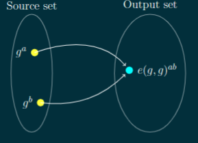

- [[snarks]] is the truly ingenious method of proving that something is true without revealing any other information
  collapsed:: true
	- why is this useful in the first place?
		- proving a [[statement]] on [[private data]]
			- person A has more than X in his bank account
			- in the last year, a bank did not transact with an entity Y
			- matching DNA without revealing full DNA
			- one has a credit score higher than Z
		- anonymous authorization
			- proving that requester R has right to access web-sites restricted area without revealing its identity
			- prove that one is from the list of allowed countries/states without revealing from which one exactly
			- prove that one owns a monthly pass to a subway/metro without revealing card's id
		- anonymous payment
			- payment with full detatchment from any kind of identity
			- paying taxes without revealing one's earnings
		- outsourcing computation
			- [[validity proof]] / [[validity rollup]]
- diagrams
  collapsed:: true
	- id:: 642a0300-5d51-43a9-928e-f0158b6d47ad
	  ```mermaid
	  graph LR
	    Prover -->|Convince| Protocol
	    Verifier -->|Learn| Protocol
	    Protocol -->|Satisfy| Properties
	    Properties --> Completeness
	    Properties --> Soundness
	    Properties --> ZeroKnowledge
	  
	    classDef goals fill:#FFA726,stroke:#333,stroke-width:2px;
	    classDef properties fill:#4CAF50,stroke:#333,stroke-width:2px;
	    class Prover,Verifier goals;
	    class Completeness,Soundness,ZeroKnowledge properties;
	  
	    subgraph Completeness
	      compDef1("if the statement is true then a prover can convince a verifier")
	    end
	  
	    subgraph Soundness
	      sndDef1("a cheating prover can not convince a verifier of a false statement")
	    end
	  
	    subgraph ZeroKnowledge
	      zkDef1("the interaction only reveals if a statement is true and nothing else")
	    end
	  
	  
	  ``` #gpt/4
	- ```mermaid
	  graph LR
	    A[Polynomial Properties] --> B[Unique Identity]
	    A --> C[Intersect at most d points]
	    B --> D[Efficient Comparison]
	    C --> D
	    D --> E[zk-SNARKs Proof Systems]
	  
	    classDef properties fill:#FFA726,stroke:#333,stroke-width:2px;
	    classDef conclusion fill:#4CAF50,stroke:#333,stroke-width:2px;
	    class A properties;
	    class B,C,D properties;
	    class E conclusion;
	  
	  ```
		- {{embed ((642a0d3e-2dc0-4f4d-be82-9673213f6674))}}
	- collapsed:: true
	  ```mermaid
	  graph LR
	    A[Byte Array] --> B[O of n Time Complexity]
	    A --> C[Inefficient for Large Arrays]
	    D[Polynomial] --> E[Unique Identity]
	    D --> F[Intersect at most d points]
	    D --> G[Efficient Comparison]
	    B --> H[Less Suitable for zk-SNARKs]
	    C --> H
	    E --> I[More Suitable for zk-SNARKs]
	    F --> I
	    G --> I
	  
	    classDef medium fill:#FFA726,stroke:#333,stroke-width:2px;
	    classDef property fill:#4CAF50,stroke:#333,stroke-width:2px;
	    classDef conclusion fill:#2196F3,stroke:#333,stroke-width:2px;
	    class A,D medium;
	    class B,C,E,F,G property;
	    class H,I conclusion;
	  
	  ``` #gpt/4
		- ((642a10a0-ccb0-4395-b78d-449ec026c27f))
	- ```mermaid
	  graph LR
	    A[Fundamental Theorem of Algebra] --> B[Prove Prover Knows Polynomial]
	    B --> C[Protocol for Polynomial Identity Checks]
	    C --> D[Verifier Samples Random Value r = 23]
	    C --> E[Prover Calculates Arbitrary Polynomial]
	    C --> F[Verifier Checks Prover's Evaluation]
	    G[Limitation: Integer Coefficients] --> H[Cryptographic Primitives]
	  
	    subgraph Example
	      EX1("Prover's Polynomial: x^3 - 3x^2 + 2x")
	      EX2("Target Polynomial: (x - 1) * (x - 2)")
	      EX3("Arbitrary Polynomial: x")
	    end
	  
	    classDef mainConcept fill:#FFA726,stroke:#333,stroke-width:2px;
	    classDef process fill:#4CAF50,stroke:#333,stroke-width:2px;
	    classDef limitation fill:#F44336,stroke:#333,stroke-width:2px;
	    class A,B mainConcept;
	    class D,E,F process;
	    class G,H limitation;
	  
	  ```
	-
- ((642a0477-a34f-4cb8-96d3-f2e5ce233731))c
  collapsed:: true
	- example [[interactive proof protocols]] that don't use polynomials
	  collapsed:: true
		- imagine we have an array of bits of length 10
		- we want to prove to a verifier (e.g. a program) that all those bits  are set to 1
			- i.e., we know an array such that every element equals to 1
		- Hello Verifier can only check/read one element at a time
		- in order to verifiy the [[statement]]
			- one can proceed by reading elements in some arbitrary order and checking if its equal to one
			- if so the confidence in the statement after the first check is 1/10 or the statement is invalidated altogether if the bit equals to 0
			- a verifier must proceed to the next rount until he reaches sufficient confidence
			- in some cases, one may trust a prover and require only 50% confidence which means that 5 checks must be executed, in other cases where 95% confidence is needed all cells must be checked
		- it is clear that the downside of such a proving protocol
			- is
				- that
					- one must do the number of checks proportionate to the number of elements, which is non-practical if we consider arrays of millions of elements
						- [[complexity theory]] would put this as having O(n)
	- ((642a074b-ad20-436a-9c13-3df59e640f1a))
		- the [[polynomial/degree]] is determined by its greatest exponent of x
		- different polynomials  can intersect up to the limit the highest degree of the two polynomials
		- finding the intersection of polynomials creates another polynomial that has an upperbound limit of the highest root of the polynomials and
		- the fact that two non-equal polynomials can only have a limited number of equal evaluations
		  id:: 642a0d3e-2dc0-4f4d-be82-9673213f6674
		  collapsed:: true
			-
			- means that
				- comparing
					- the evaluations of a few points can provide a high degree of confidence that the two polynomaisl are the same or different
		- ((6429fe54-48a2-4491-914b-599b2dc7f62c))
			- verifier generates an element, evaluates it against a polynomial locally
			- verifier gives an element to the prover and asks to evaluated tthe polynomial in question
			- prover evaluates his polynomial at x and gives the result to the verifier
			- verifier checks if the local result is equal to the prover's result, and if so then the statement is proven with a high confidence
- ((642a10f7-dd73-4c72-bd0d-451fdbbf1400))
  collapsed:: true
	- Proving Knowledge of a Polynomial
		- parties having to trust each other
			- means that
				- there are no measures yet to enforce the rules of the protocol
					- prover does not have to necessarily use the proof medium (polynomial)
					- if the degree of the polynomial is low, then there is a non-negligible probability that it will be accepted
		- to address weaknesses to the protocol, we have to inquire on the nature of knowing a polynomial
		- if one stated that he or she knows a polynomial of degree 1
			- that means that
				- what one really knows is the coefficients c_0, c_1
		- let's say that the prover claims to know a degree 3 polynomial
			- such that
				- x = 1,2 are two possible solutions
			- one such valid polynomials is x^3 - 3x^2 + 2x = 0
	- Factorization
		- [[The Fundamental Theorem of Algebra]] states that any polynomial can be factored into linear polynomials (i.e. a degree of 1 polynomials representing a line), as long as it is solvable
			- this means we can represent any valid polynomial as a product of its factors
				- (x-a_0)*(x- a_1)...(x-a_n) = 0
					- if any of these factors is zero then the whole equation is zero, henceforth all the a's are the only solutions
				- in fact, our factor can be factored into the following polynomial
					- x^3 - 3x^2 + 2x = (x - 0) * (x-1) * (x- 2)
						- [[polynomial/root]]
		- the example of a prover claiming to know a polynomial of degree 3 with roots 1 and 2
			- this means that his polynomial has the form (x -1) * (x-2)
		- in other words, (x - 1) and (x- 2) are the cofactors of the polynomial in question
			- hence if
				- the prover wants to prove that indeed his polynomial has those roots without disclosing the polynomial itself
				- he needs to prove that his polynomial `p(x)` is the multiplication of those cofactors
					- stated polynomial = target polynomial * arbitrary polynomial
		- in other words, there exists some polynomial that makes the provers stated polynomial equal to target polynomial
			- therefore the prover's stated polynomial contains the target polynomial
				- consequently
					- prover's stated polynomial has all the roots of target polynomial, the very thing to proven
		- a natural way to find the arbitrary polynomial is through [[polynomial/division]]
			- if the prover cannot find such an arbitrary polynomial
				- that means that
					- provers stated polynomial does not have the necessary cofactors (target polynomial) in which case the [[polynomial/division]] will have a remainder
		- using our polynomial identity check protocol
			- we can compare the provers claimed polynomial, the target polynomial, and the arbitrary polynomial
				- [[verifier]] samples a random value `r`, calculates target polynomial at r, and gives r to the prover
				- prover calculates the arbitrary polynomial via dividing their stated polynomial by the target polynomial. they calculate values of r in the stated polynomial and the arbitrary polynomial, the resulting values provided to the verifier
				- verifier checks that the stated polynomial at r is equal to  the target polynomial at r * the arbitrary polynomial at r
		- to put this into practice
			- let us execute this protocol for our example
				- prover claimed polynomial = x^3 - 3x^2 + 2x
				- target polynomial = (x - 1) * (x-2)
			- verifier samples a random value 23, calculates 23 at target polynomial and gives 23 to the prover
			- prover calculates the arbitrary polynomial by dividing  prover's polynomial by the target polynomial and evaluates verifier's given value at its polynomial and the arbitrary polynomial and gives it to the verifier
			- verifier then checks that the provers evaluated value at their polynomial is equal to the value evaluated at the target polynomial and the arbitrary polynomial
			- on the contrary
			  collapsed:: true
				- if the prover uses a different polynomial, which does not have the necessary cofactors, division will have a remainder
					- this means that the prover will have to divide by the remainder by the target polynomial in order to estimate the arbitrary polynomial
					- therefore because of the random selection of x by the vierifer
						- there is a low probability
							- that
								- the evaluation of the remainder will be evenly divisible by the evaluation of t(x)
									- henceforth if verifier will additionally check that handed values by prover must be integers, such proofs will be rejected
										- however, the check requires the polynomial coefficients to be integers too, creating a significant limitation to the protocol
											- that is the reason to introduce cryptographic primitives which make such division impossible, even if the raw evaluations happen to be divisible
		- remark 3.1
		  id:: 642ac4ee-c68b-4cd4-abd4-0dd28fbf9e28
			- now e can check a polynomial for specific properties without learning the polynomial itself, so this already gives us some form of [[zero knowledginess]] and [[succinctness]]
			- never the less, there are multiple issues with this constructure
				- prover may not know the claimed polynomial `p(x)` at all. they can calculate evaluation at the target, select a random number h and set polynomial equals target by h, which will be accepted by the verifier as valid, since the equation holds
				  id:: 642ac549-c8f2-475e-ba6f-a07f4205c4fe
				- because prover knows the random point, he can construct any polynomial that has one shared point at r
				  id:: 642ac589-a504-4eb5-bc07-5538e4fad804
				- in the original statement, prover claims to know a polynomial of a particular degree, in the current protocol there is no enforcement of degree. hence prover can cheat by using a polynomial of a higher degree which also satsifies the cofactors check
			-
	- Obscure Evaluation
	  collapsed:: true
		- the first two issues of remark 3.1 are possible because values presented at raw, provers knows r and t(r)
		  collapsed:: true
			- ((642ac549-c8f2-475e-ba6f-a07f4205c4fe))
			- ((642ac589-a504-4eb5-bc07-5538e4fad804))
		- it would be given as a black box so one cannot temper with the protocol, but still able to computer operations on those obscure values
		  collapsed:: true
			- something similar to the hash function,
				- such that when computed
					- it is hard to go back to the original input
		- ((642ac6bc-2449-4fd1-a5cb-4426870a658c))
			- this is exactly what [[Homomorphic Encryption]] is designed for.
			- namely it allows to encrypt a value and be able to apply arithmetic operations on such encryption
			- there are multiple ways to achieve homomorphic properties of encryption, and we will briefly introduce a simple one
			- the general idea is that we choose a base natural number g (say 5) and to encrypt a value we exponentiate g to that power of that value.
				- for example, if we want to encrypt the number three: 5^3 = 125
					- where 125 is the encryption of 3
			- if we want to multiply this encrypted number by 2, we raise it to the exponent of 2
				- 125^2 = 15625 = 5^6
			- we were able to multiply an unknown value by 2 and keep it encrypted. we can aso add two encrypted values through multiplication, for example 3+2
				- 5^3 * 5^2 = 5^5 = 3125
			- similarily, we can subtract encrypted numbers throguh division, for example 5-3
				- 5^5/5^3 = 5^5 * 5^-3 = 25
			- however, since the base 5 is public, it is quite easy to go back to the secret number, dividing encrypted by 5 until the result is 1. the number of steps is the secret number
			  id:: 642ac7f2-5af7-4b47-a4b3-d993613c8e8d
		- ((642ac864-8d08-4b64-a1d7-c556fb3a6a29))
			- this is where [[Modular Arithmetic]] comes into play
			- the idea of modular arithmetic is following:
			  collapsed:: true
				- instead of having an infinite set of numbers
					- we declare that
						- we select only first n natural numbers to work with
							- and if
								- any given integer
									- falls out of
										- this range
								- we "wrap" it around
			- ((642ac8f5-0a88-4008-804a-6d9be5572971))
		- ((642ac938-4a61-46f2-be59-c3211c808aa3))
			- encoding with modular arithmetic means its harder to decode, i.e it redresses: ((642ac7f2-5af7-4b47-a4b3-d993613c8e8d))
			- ((642aca49-1f0e-4075-8f8e-c2de048b7a5f))
			- ((642acae8-f122-4a54-bc31-b29c53c7af69))
			- remark 3.2
			  id:: 642acaf1-c5be-4024-a5e7-6361294c4f5b
				- there are limitations to this homomorphic encryption scheme while we multiply an encrypted value by an unencrpted value, we cannot multiple and divide two encrypted values, as well as cannot exponentiate an encrypted value
				- while unfortunate from the first impression, these properties will turn out to be the cornerstone of [[snarks]]
				- the limitations are addressed in section 3.6.1
			-
		- ((642acbc9-a4db-4fea-a01a-f7eeaf64261e))
			- armed with such tools, we can now evaluate a polynomial with an encrypted random value of x and modify the zero knowledge protocol accordingly
			- let us see how we can evaluate a polynomial `p(x) = x^3 - 3x^2 + 2x`
				- as we have established previously to know a polynomial is to know its coefficients, in this case those are: 1, -3, 2.
				- because homomorphic encryption does not allow to exponentiate an encrypted value, we're given the exponentiated values that are then encrypted and then put into homomorphic operations
					- ((642ace37-a942-41c0-984b-6189184f8bf1))
				- ((642aceef-6ac1-4573-b415-8c4c4954039b))
			-
		- ((642acf21-3316-42c5-b8a4-665455c4502c))
			- ((642acf6c-3049-4093-8ecc-1cbf46c235b9))
				- ((642acfbb-9253-4bf4-a22a-1b9478df8c47))
		- ((642ad080-d269-479a-b790-a4337c9b700d))
			- because verifier can extract knowledge about the unknown polynomial of the proover only from the data sent by the prover
				- let us consider those provided values (the proof): g^p, g^'p', g^h
					- \begin{equation}
					  g^{p} = (g^h)^{t^{s}}
					  \end{equation}
						- (polynomial p(x) has roots of t(x))
					- \begin{equation}
					  (g^{p})^{\alpha} = g^{p'}
					  \end{equation}
						- polynomial of a correct form is used
			- ((642ad1c4-7067-4579-bd05-440a42b01660))
			- to maintain relationships
				- let us examine
					- the verifier's check
						- one of the provers values is on  each side of the equation
							- therefore if we "shift" each of them with the same \delta the equations must remain balanced
					- concretely
						- prover samples a random \delta and exponentiates his proof values with it
							- \begin{equation}
							  (g^{p(s)})^{\delta},
							  (g^{h(s)})^{\delta},
							  (g^{\alpha*p(s)})^{\delta}
							  \end{equation}
				- after consolidation we can observe that the check still holds
					- \begin{equation}
					  (g^{p(s) \delta }) = (g^{t(s)  h})
					  ,
					  (g^{p * \delta * \alpha }) = g^{\delta * p'}
					  \end{equation}
			- note: how easily the [[zero knowledginess]] is woven into the construction, this is often refered to as "free" zero-knowledge
		- ((642b1c7e-86c7-465d-ac41-bbdf8432a78c))
		  collapsed:: true
			- till this point
				- we had an interactive zero-knowledge scheme
					- why is that the case?
						- because the proof is only valid for the original verifier,
							- nobody else (other verifiers) can trust the same proof since
								- as mentioned in ((642ac4ee-c68b-4cd4-abd4-0dd28fbf9e28)) the verifier
								  collapsed:: true
									- could collude with
										- the prover
									- disclose
										- these secret parameters s, \alpha
											- which allows to fake
												- the proof
								- the verifier can generate [[false proof]] for the same reason
								- verifier have to store \alpha and t(s) until all relevant proofs are verified, which allows an extra attack surface with possible leakage of secret parameters
							- therefore
								- a separate interaction with every verifier
									- is required in order for
										- a [[statement]] (knowledge of polynomial in this case)
											- to be proven
				- while [[interactive proof protocols]] has its use cases
					- for example when
						- a prover wants to convince a dedicated verifier (called designated veriifier)
							- such that
								- the proof cannot be re-used to prove the same statement to others
						- it is quite inefficient when
							- one needs to convince many parties simultaneously
								- (e.g. in distributed systems such as [[blockchain]] )
							- or permanently
					- prover would be required to stay online at all times and perform the same computation for every verifier
						- hence we need the secret parameters to be reusable, public, trustworthy and infeasible to abuse
			- let us first consider how we would secure the secrets (t(s), \alpha) after they are produced
			- we can encrypt them the same way verifier encrypts powers of s before sending to the prover
			- however as mentioned in ((642acaf1-c5be-4024-a5e7-6361294c4f5b)), the [[Homomorphic Encryption]] we use does not support the multplication of two encrypted values, which is necessary for both verification checks to multiple encryptions of t(s) and h as wel as p and \alpha
				- this is where [[cryptographic pairings]] fit in
			- ((642b31d0-c268-483a-ba4f-46556ba8b6fa))
				- [[cryptographic pairings]] (bilnear map) is a mathematical construction
					- denoted as
						- a function e(g*, g*) which
							- given
								- two encrypted inputs g^{a}, g^{b} from one set of numbers
							- allows to map them deterministically to their multiplied representation in a different output set of numbers
								- i.e. e(g^{a}, g^{b}) = e(g, g)^{ab}
								- 
				- because the source and output number sets are different,  the results of the pairings is not usable as an input for another pairing operation.
				- we can look at the output set (also called target set) as being from a different universe
				- therefore
					- we cannot multiply the result by another encrypted value and suggested by the name itself we can only multiply two encrypted values at a time
				- it some sense, it resembles a [[hash function]], which maps all possible input values to an element in the set of possible output values and it is not trivially reversible
				- ((642b34b1-a764-4234-b583-0348b9487b5c))
				- a rudimentary (and technically incorrect) mathematical analogy for pairing function
					- would be to state that
						- there is a way to "swap" each input's base and exponent
							- such that
								- base g
									- is modified in
										- the process of transformation into exponent
											- e.g. g^{a} -> a^{g}
					- both "swapped" inputs are then multiplied together,
						- such that
							- raw a and b values
								- get multiplied under
									- the same exponent, e.g.:
										- e(g^{a}, g^{b}) = a^{g} * b^{g} = (ab)^{g}
					- therefore
						- because
							- the base gets altered during the swap
						- using the result (ab)^{g} in another pairing
							- (e.g. e((ab)^{g}, g^{c}))
							- would not produce
								- desired encrypted multiplication abc
					- the core properties of pairings can be expressed in the equations
						- e(g^{a}, g^{b}) = e(g^{b}, g^{a}) = e(g^{ab}, g^{1}) = e(g^{1}, g^{ab}) = e(g^{1}, g^{a})^{b} = e(g^{1}, g^{1})^{ab}
				- technically the result of a pairing is an encrypted product of raw values under a different [[generator]] g of the target set
					- i.e. e(g^{a}, g^{b})  = g^{ab}
				- therefore it has properties of [[Homomorphic Encryption]]
					- e.g. we can add engrypted products of multiple parings together
						- e(g^{a}, g^{b}) * e(g^{e}, g^{d}) = g^{ab} * g^{cd} = g^{ab + cd} = e(g, g)^{ab + cd}
				- note: [[cryptographic pairings]] is leveraging [[Elliptic Curves]] to achieve these properties
					- therefore from now on notation g^{n}
						- will represent
							- a [[generator element]] on a curve added to itself n times
						- instead of
							- a multiplicative group generator
								- which we have used in
									- previous sections
					-
			-
			-
			- ((642b3afb-0790-4053-87dd-760b35541fed))
			  collapsed:: true
				- having [[cryptographic pairings]]
					- we are now ready to set up secure public and reusable parameters
				- let us assume
					- that
						- we
							- trust
								- a single honest party
							- to generate
								- secrets s and \alpha
				- as soon as
					- \alpha and all necessary power of s with with corresponding \alpha-shifts
						- are encrypted
							- g^\alpha, g^{s^{i}}, g^\alpha s^{i}}
								- for i in 0, 1, ...d
									- the raw values must be deleted
				- these parameters are usually referred to as [[Common Reference String]] or CRS
				- after CRS is generated any prover and any verifier can use it in order to conduct [[non-interactive]] zero-knowledge proof protocol
				- while non-crucial, the optimized version of CRS will included evaluation of the target polynomial g^{t(s)}
				- moreover CRS is divided into two groups (for i in 0, 1, ..., d):
					- [[proving key]]
					- [[verifying key]]
				- being able to multiple encrypted values, the verifier can check the polynomials in the last step of the protocl
					- having [[verifying key]] verifier processes received encrypted polynomial evaluations g^{p}, g^{h}, g^{p'} from the prover
						- checks that p = t by h in encrypted space
							- e(g^{p}, g^{1}) = e(g^{t}, g^{h})
								- which is equivalent to
									- e(g, g)^{p} = e(g, g)^{t h}
						- checks [[polynomial/restriction]]
							- $$ e(g^{p}, g^{\alpha}) = e(g^{p'}, g) $$
					-
			- ((642b43de-393c-431a-b48a-07a60de0af02))
			  collapsed:: true
				- while [[trusted setup]] is efficient
					- it is not effective since
						- multiple users of [[Common Reference String]]
							- will have to
								- [[trust]]
									- that
										- one deleted \alpha and s
											- since there is no way to prove that
				- hence it is necessary to minimize or eliminate that [[trust]]
				- otherwise a dishonest party would be able to produce [[false proof]] without being detected
				- one way to achieve that is by generating a composite CRS by multiple parties employing mathematical tools introduced in previous sections
					- such that
						- neither of those parties knows the secret
				- ((642b454a-2ffb-4252-a4b9-7e6c4b2b7424))
				-
		- ((642b45a2-3dc6-45a9-8f16-21c15d5399bd))
			- we are now ready to consolidate the evolved [[snarks]] protocol
			- being formal, for brevity, we will use curly brackets to denote a set of elements populated by the subscript next to it, for example $$  \{ s^{i}  \}_{i \ni |d|}  $$
			- having agreed upon the target polynomial t(x) and degree d of prover's polynomial
				- setup
					- sample random values s, \alpha
					- calculate encryptions g to the \alpha and $$  \{ g^{s^{i}}  \}_{ i \ni |d|} , \{ g^{ \alpha s^{i}}  \}_{i \ni  \{0,..., d\}}   $$
					- [[proving key]] : $$  \Biggl( \{ g^{s^{i}}  \}_{ i \ni |d|} , \{ g^{ \alpha s^{i}}  \}_{i \ni  \{0,..., d\}}  \Biggl)  $$
					- [[verifying key]]: $$ \left( g^{ \alpha },  g^{t(s)} \right) $$
				- proving
					- assigning coefficients
						- $$ \{ c_i  \}_{i \ni  \{0,..., d\}}  $$ (i.e. knowledge), $$ p(x) = c_d x^{d} + \cdots + c_1x^{1} + c_0x^0 $$
					- calculate polynomial $$ h(x) = \frac{p(x)}{t(x)} $$
					- evaluate encrypted polynomials g^{p(s)} and g^{h(s)} using $$ \{ g^{s^{i}}  \}_{ i \ni |d|}  $$
					- evaluate encrypted shifted polynomial $$ g^{ \alpha p(s)} $$  using $$ \{ g^{ \alpha s^{i}}  \}_{i \ni  \{0,..., d\}} $$
					- sample random \delta
					- set the randomized proof $$ \pi = ( (g^{\delta p(s)}), (g^{\delta h(s)})(g^{ \delta \alpha*p(s)})) $$
				- verification
					- parse proof \pi as $$ ( g^{p}, g^{h}, g^{p'} ) $$
					- check polynomial restriction  $$ e(g^{p'}, g ) = e(g^{p}, g^{ \alpha }  ) $$
					- checking polynomial cofactors $$ e(g^{p}, g ) = e(g^{t(s)}, g^{ h }  ) $$
			- remark 3.3
			  collapsed:: true
				- if it would be possible to reuse result of pairing for another multiplication
					- such protocol would be completely insecure
						- because
							- the prover can assign $$ g^{p'} = e(g^p, g^{ \alpha } ) $$
								- which would then pass
									- the polynomial restriction check
										- $$ e(e(g^p, g^{ \alpha }), g) = e( g^{p}, g^{ \alpha }) $$
			- ((642b529c-e67b-4878-bac4-eb26f4d218c2))
				- we came to zero-knowledge succinct non-interactive arguments of knowledge protocol for the knowledge of a polynomial problem
					- which is a niche use-case
				- while one can claim that a prover can easily construct such a polynomial p(x) just multiplying t(x) by another bounded polynomial to make it pass the test, the construction is still useful
				- verifier knows that the prover has a valid polynomial but not which particular one
				- we could add additional proofs of other properties of the polynomial
					- divides by multiple polynomials
					- is a square of a polynomial
				- there could be a service which accepts, stores, and rewards all the attested polynomials, or there is a need in an encrypted evaluation of unkown polynomials iof a necessary form.
				- however, having universal scheme would allow for a myriad of applications
			-
			-
		-
- ((642b5365-ac49-4056-a7eb-fab62bf1cb73))