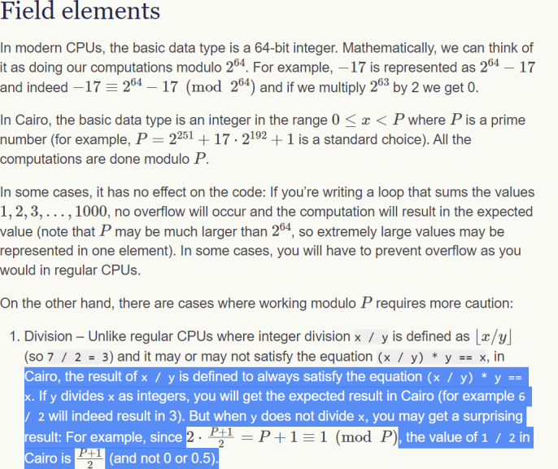

- find vulnerability in this entry to cairo underhanded competition
	- shadowing of two contracts declaration of a storage_var `owns` without adequate namespacing (tkn and own)
	- this means that there is incidental overlap in two logics -- tracking balance and tracking role, where the balance of 109 (which corresponds to the ascii character 'M' which is how the  mint role is codified) or balance of 98 (which corresponds to the ascii character 'b' which is how the burn role is modified)
	- this means if a user has a balance of 109/98, they get role access in the contract incidentally. not cool.
- can you find the flaw in these pieces of code
	- [example 2](https://gist.github.com/extropyCoder/1c499fc14ecfb6cf929b44e797daf3eb)
	  
	  ```cairo
	  @external
	  func bad_normalize_tokens{syscall_ptr: felt*, pedersen_ptr: HashBuiltin*, range_check_ptr}() -> (
	      normalized_balance: felt
	  ) {
	      let (user) = get_caller_address();
	  
	      let (user_current_balance) = user_balances.read(user);
	      let (normalized_balance) = user_current_balance / 10 ** 18;
	  
	      return (normalized_balance,);
	  }
	  ```
		- issue with truncation / underflow.
		- as specified [here](https://www.cairo-lang.org/docs/how_cairo_works/cairo_intro.html) the felt integer type needs caution when doing division
			- cairo's vision is defined to always satisfy the equation (x / y) * y == x
			- if y divides x as integers, you will get the expected result in cairo
				- `6/2 = 3`
			- but when y does not divide x, you may get a surprising result
				- 
				-
	- [example 1](https://gist.github.com/extropyCoder/d09d92f624ca4288ac2e146ebf49d427)
	  ```cairo
	  @storage_var
	  func max_supply() -> (res: felt) {
	  }
	  
	  @external
	  func bad_function{syscall_ptr : felt*, pedersen_ptr : HashBuiltin*, range_check_ptr}() {
	      let (value: felt) = ERC20.total_supply();
	      assert_le{range_check_ptr=range_check_ptr}(value, max_supply.read());
	  
	      // do something...
	  
	      return ();
	  }
	  ```
		- is the issue not encoding erc20 values as [[uint256]]?
		-
- read through the issues in starknet-dai bridge [audit](https://chainsecurity.com/wp-content/uploads/2021/12/ChainSecurity_MakerDAO_StarkNet-DAI-Bridge_audit.pdf)